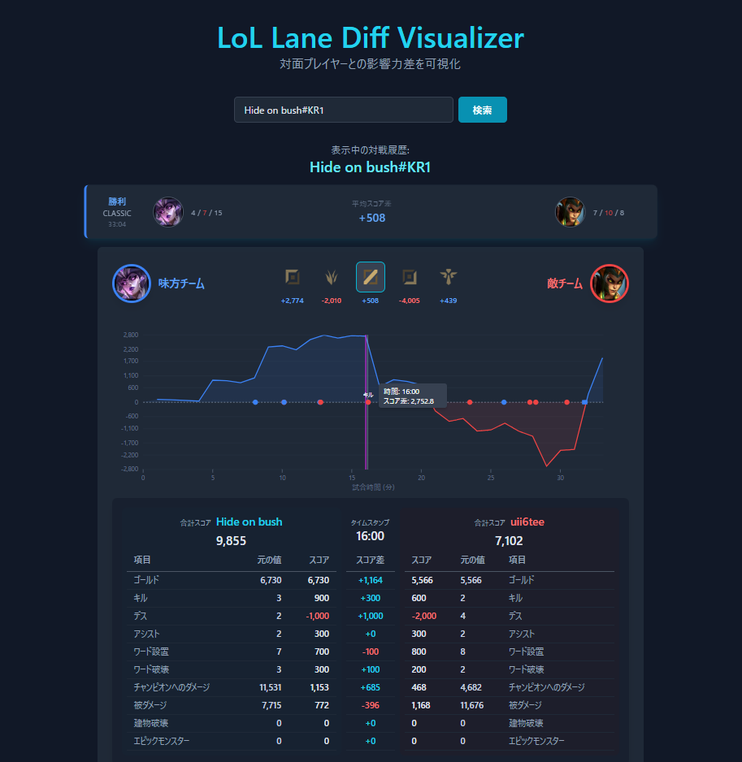

# LoL Matchup State ⚔️📊

League of Legends (LoL) の対面（同ロールの対戦相手）との形勢・スコア差の推移を時間経過グラフで直感的に分析できるWebアプリケーションです。

---

## 📷 アプリの画面スクショ



---

## 📖 概要

**LoL Matchup State** は、Riot Games API を活用してプレイヤーの過去の対戦データを詳細に解析するツールです。  
従来の戦績閲覧サイトと異なり、単純なゴールド差だけでなく、CS、KDA、視界管理（ワード）、オブジェクト破壊、与・被ダメージ量を総合的に評価した**独自のスコア算出アルゴリズム**を採用しています。

レーン戦から集団戦にかけて「いつ・どのタイミングで形勢が傾いたか」「対面と比べてどの要素で差がついたか」を折れ線グラフとタイムラインイベントで一目で把握できます。

### ✨ 主な機能
- **Riot ID 検索**: `ゲーム名#タグ`（例: `PlayerName#JP1`）を入力して直近の対戦履歴を取得・分析。
- **対面スコア差グラフ (Score Chart)**: 試合経過（分・秒）に応じた対面プレイヤーとのスコア差推移を視覚化。
- **総合スコア算出ロジック**:
  - **Gold**: 1 Gold = +1 pt
  - **KDA**: Kill = +300 pt / Death = -500 pt / Assist = +150 pt
  - **視界貢献**: ワード設置 = +100 pt / ワード破壊 = +100 pt
  - **ダメージ量**: チャンピオンへの与ダメージ 10ダメージごとに +1 pt / 被ダメージ 10ダメージごとに +1 pt
  - **オブジェクト**: タワー破壊 = +700 pt / エリートモンスター（ドラゴン・バロン等）撃破 = +500 pt
- **ゲームイベント・タイムライン表示**: グラフ上の特定の時間帯で発生したキルやタワー・ドラゴン等の獲得イベントをキャッチして詳細表示。
- **レスポンシブデザイン**: モバイル・デスクトップどちらの画面サイズでも見やすく調整されたUI。

---

## 🛠️ 使用技術 (Tech Stack)

- **Front-end**: React (v18), Vite, Tailwind CSS
- **Visualization**: D3.js (`d3-path`)
- **HTTP Client**: Axios
- **API Serverless Proxy**: Netlify Functions (本番環境), Vite Proxy (開発環境)
- **Data Source**: Riot Games API (Account-v1, Match-v5)

---

## 🚀 動かし方 (Getting Started)

ローカル開発環境でアプリを起動する手順は以下の通りです。

### 1. 前提条件 (Prerequisites)

- **Node.js**: v18.0.0 以上推奨
- **npm** または **yarn** / **pnpm**
- **Riot Games Developer API Key**: [Riot Developer Portal](https://developer.riotgames.com/) より取得してください。

### 2. 依存関係のインストール

```bash
# パッケージのインストール
npm install
```

### 3. 環境変数の設定 (`.env.local`)

プロジェクト直下に `.env.local` ファイルを作成し、取得した Riot API Key を記述します。

```env
VITE_RIOT_API_KEY=RGAPI-xxxxxxx-xxxx-xxxx-xxxx-xxxxxxxxxxxx
```

> ⚠️ **注意**: APIキーの流出を防ぐため、`.env.local` は `.gitignore` に含まれています。リポジトリにはコミットしないでください。

### 4. 開発サーバーの起動

```bash
npm run dev
```

コマンド実行後、ブラウザで `http://localhost:5173`（または表示されたローカルURL）にアクセスしてください。

---

## 📦 ビルド & デプロイ (Build & Deployment)

### 本番用ビルド
```bash
npm run build
```

### ビルド結果のプレビュー
```bash
npm run preview
```

### Netlify へのデプロイ
Netlify 管理画面の「Environment variables」にて、以下の環境変数を設定してください。
- `RIOT_API_KEY`: Riot Games API Key

`netlify/functions/riotApi.js` がプロキシとして機能し、本番環境での CORS 制約回避および API キーの保護を行います。
